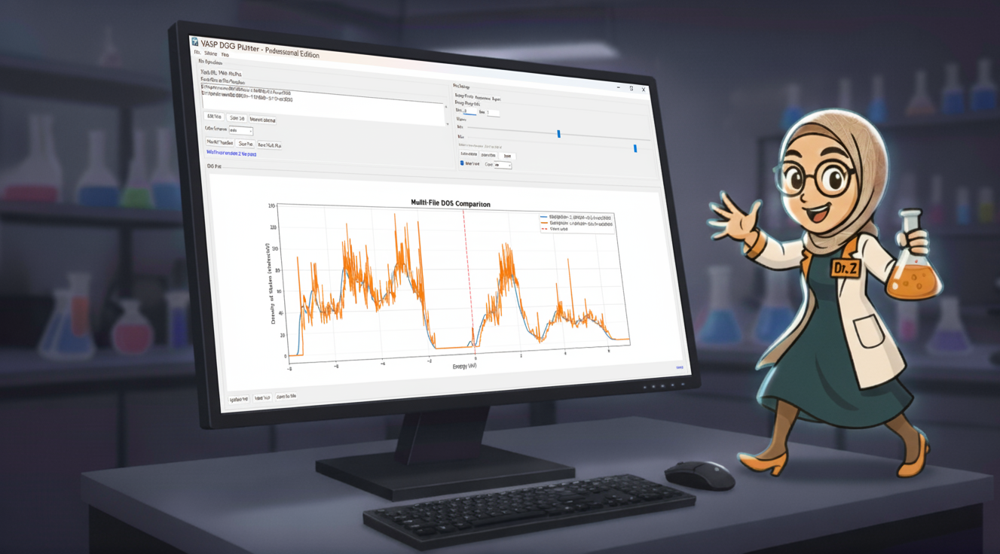

# VASP DOS Plotting Project

This project demonstrates how to create Density of States (DOS) plots using VASP output files (vasprun.xml) and provides multiple plotting options.

> 📖 **Learn More**: Check out our [About Section](ABOUT.md) to meet our mascot and learn about the project's mission! 🎨  
> 👨‍🔬 **Meet the Author**: Learn about [Zeinab H. Fard](AUTHOR.md), the Ph.D. researcher behind this project! 🧪

## GUI Application Screenshot



*The intuitive graphical interface makes it easy to load DOS files, customize plot settings, and export high-quality plots for publications.*

## Project Structure

```
vrun/
├── vasp_dos_plotter/   # Main package directory
│   ├── __init__.py     # Package initialization
│   ├── gui.py          # Main GUI application
│   └── plotter.py      # Command-line plotting functionality
├── run_gui.py          # Simple GUI launcher
├── launch_gui.bat      # Windows launcher for GUI
├── requirements.txt    # Python package requirements
├── setup.py            # Package setup script
├── pyproject.toml      # Modern Python packaging configuration
├── README.md           # This documentation
├── ABOUT.md            # About section with mascot and project details
├── AUTHOR.md           # Author information and background
├── GUI_USAGE_GUIDE.md  # Detailed GUI usage guide
├── CONTRIBUTING.md     # Contribution guidelines
├── CHANGELOG.md        # Version history
├── CODE_OF_CONDUCT.md  # Code of conduct
├── SECURITY.md         # Security policy
├── LICENSE             # MIT License
├── logo.png            # Professional logo for the application
├── icon.png            # Application icon
├── favicon.png         # Favicon for web interfaces
├── DrZ.png             # Project mascot and author photo
├── RES/                # Sample data directory
│   └── DOS0            # Real VASP DOS data file
└── venv/               # Python virtual environment
```

## Setup Instructions

### Option 1: Using Virtual Environment (Recommended)

1. Create a virtual environment:
   ```bash
   python -m venv venv
   ```

2. Activate the virtual environment:
   - On Windows: `venv\Scripts\activate`
   - On macOS/Linux: `source venv/bin/activate`

3. Install required packages:
   ```bash
   pip install -r requirements.txt
   ```

### Option 2: System-wide Installation

Install packages directly to your system Python:
```bash
pip install pymatgen matplotlib numpy
```

## Usage

### Method 1: GUI Application (Recommended)

Launch the intuitive graphical interface:

```bash
# Option 1: Direct launch
python run_gui.py

# Option 2: Using the batch file (Windows)
launch_gui.bat

# Option 3: Install as package and use command
pip install -e .
vasp-dos-plotter
```

Or use the launcher:
```bash
launch_gui.bat
```

**GUI Features:**
- 📁 **File Management**: Browse and load DOS files easily with smart file type detection
- ⚙️ **Customizable Settings**: Adjust energy range, colors, fonts, and more with interactive sliders
- 📊 **Real-time Plotting**: See changes instantly as you adjust settings with debounced updates
- 💾 **Multiple Export Options**: Save plots as PNG, PDF, SVG or export data as CSV
- 🎯 **Smart Defaults**: Auto-detect optimal energy ranges for both single and multi-file modes
- 📈 **Professional Output**: High-quality plots suitable for publications
- 🔄 **Multi-File Plotting**: Compare multiple DOS files in a single plot with different colors and smart legend
- 🎨 **Context-Aware Settings**: Sliders and controls adapt to single-file vs multi-file plotting modes
- 📍 **Smart Legend**: File paths shown in legend with intelligent truncation and formatting

### Method 2: Command Line Script

For automated or batch processing:

```bash
python -m vasp_dos_plotter.plotter
```

This script:
- Reads real VASP DOS files (like `RES/DOS0`)
- Creates professional plots with -7 to 7 eV bounds
- Provides detailed statistics
- Saves filtered data for further analysis

## Understanding the Output

### DOS Plot Features

- **Energy Axis**: Typically in eV, with Fermi level at 0 eV
- **DOS Axis**: Density of states in states/eV
- **Fermi Level**: Marked with a red dashed line
- **Peaks**: Represent electronic states at specific energies

### Sample Data

The included `vasprun.xml` contains:
- A simple hydrogen atom system
- Energy eigenvalues from -5 to 4 eV
- DOS data with Gaussian-like peaks
- Fermi level at 0 eV

## Troubleshooting

### Common Issues

1. **ImportError for numpy/matplotlib**: 
   - Try installing with `--user` flag: `pip install --user numpy matplotlib`
   - Or use the basic plotting script that doesn't require external packages

2. **VASP file parsing errors**:
   - The script will fall back to synthetic data
   - Ensure your vasprun.xml is complete and properly formatted

3. **Virtual environment issues**:
   - Use the basic plotting script as a fallback
   - Or install packages system-wide

### Alternative Plotting Methods

If Python plotting doesn't work, you can:

1. **Use the generated data file**:
   - Import `dos_data.txt` into Excel, Origin, or other plotting software
   - Columns are: Energy(eV) and DOS(states/eV)

2. **Use Gnuplot**:
   - Install Gnuplot from https://gnuplot.info/
   - Run: `gnuplot plot_dos.gp`

3. **Use online plotting tools**:
   - Upload `dos_data.txt` to online plotting services
   - Many scientific plotting websites accept tab-delimited data

## GUI Application Features

### 📁 File Management
- **Browse Files**: Easy file selection with dialog (defaults to "All files")
- **Quick Load**: One-click loading of `RES/DOS0` or sample data
- **File Info**: Display data statistics and file details
- **Multiple Formats**: Support for various DOS file formats
- **Tabbed Interface**: Separate tabs for single file and multi-file operations

### ⚙️ Customizable Settings
- **Energy Range**: Adjustable min/max bounds with interactive sliders and auto-detection
- **Line Properties**: Width, color, and style customization
- **Fermi Level**: Toggle display with color options
- **Grid Settings**: Show/hide grid with transparency control
- **Font Control**: Adjustable font sizes for labels and titles
- **Context-Aware**: Settings adapt to single-file vs multi-file plotting modes
- **Real-time Updates**: Debounced slider updates for smooth interaction

### 📊 Real-time Plotting
- **Live Updates**: See changes instantly as you adjust settings
- **Interactive Controls**: Zoom, reset view, and auto-detect ranges
- **Professional Display**: High-quality matplotlib integration
- **Status Updates**: Real-time feedback on operations

### 💾 Export Options
- **Multiple Formats**: PNG, PDF, SVG support
- **High Resolution**: Adjustable DPI up to 600
- **Custom Sizing**: Flexible figure dimensions
- **Data Export**: CSV format for further analysis
- **Settings Save/Load**: Preserve your preferences

### 🎯 Smart Features
- **Auto-detect Range**: Automatically find optimal energy bounds for single or multi-file data
- **Zoom to Data**: Quick view of full data range (context-aware for current mode)
- **Reset View**: Return to default settings
- **Error Handling**: Graceful handling of file issues
- **Multi-File Comparison**: Plot multiple DOS files together with different colors
- **Smart Legend**: Intelligent file path formatting with truncation
- **Color Schemes**: Multiple color palettes (auto, rainbow, viridis, plasma, tab10)
- **Threaded Processing**: Non-blocking file loading and plot updates

## File Descriptions

- **dos_plotter_gui.py**: Main GUI application with interactive sliders, multi-file plotting, and context-aware settings
- **plot_real_dos.py**: Command-line script for real VASP DOS data plotting
- **launch_gui.bat**: Windows launcher for the GUI application
- **requirements.txt**: Python package dependencies
- **README.md**: This documentation file
- **ABOUT.md**: About section with project mascot and detailed project information
- **AUTHOR.md**: Author information and background (Zeinab H. Fard, Ph.D. researcher)
- **GUI_USAGE_GUIDE.md**: Detailed guide for using the GUI application
- **RES/DOS0**: Real VASP DOS data file (your actual data)
- **logo.png**: Professional logo for the application
- **icon.png**: Application icon for window title bar
- **favicon.png**: Favicon for web interfaces
- **DrZ.png**: Project mascot and author photo
- **venv/**: Python virtual environment with all dependencies

## Requirements

### For Full Functionality
- Python 3.7+
- pymatgen
- matplotlib
- numpy
- Pillow (for image handling in About dialog)

### For Basic Functionality
- Python 3.7+ (built-in libraries only)

### Optional
- Gnuplot (for alternative plotting)

## Example Output

The basic script produces a text-based plot showing:
```
Density of States Plot (Text-based)
==================================================
Energy (eV)    |    DOS (states/eV)
--------------------------------------------------
  -10.00     |  0.000
   -8.99     |  0.000
   -7.99     |  0.011
   -6.98     | ████ 0.139
   -5.98     | ██████████████████ 0.619
   -4.97     | ██████████████████████████████ 1.002
  ...
```

This provides a visual representation of the DOS even without graphical plotting libraries.
